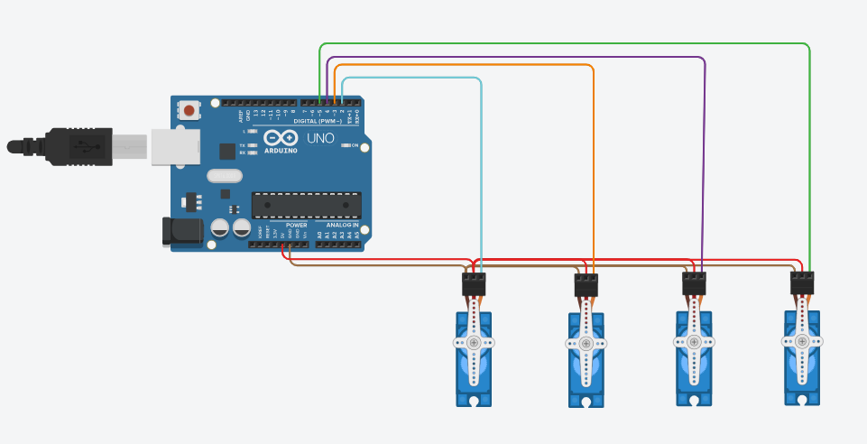

# Arduino Circuit with 4-servos 

---

## Project Title  
**Programming 4 Servo Motors in Tinkercad for Timed Sweep and Hold Position**

---

## Objective  
The objective of this project is to simulate servo motor control using Arduino in **Tinkercad**. The program runs **4 servo motors** in a sweep motion for 2 seconds and then makes all the servos **hold at 90 degrees**. This demonstrates basic servo control using the Servo library and timed motion logic.

---

## Description  
The simulation involves four servo motors connected to an **Arduino Uno**. Each motor performs the following:

- **Step 1**: Run a **sweep motion**  between 0° and 180° continuously for **2 seconds**.
- **Step 2**: After 2 seconds, all motors **move to 90°** and hold that position indefinitely.

This demonstrates how you can programmatically control timing and angle positioning for multiple servo motors using Arduino.

---

## Tools and Platform  
- **Platform**: [Tinkercad Circuits](https://www.tinkercad.com) (by Autodesk)  
- **Microcontroller**: Arduino Uno  
- **Components Used**:
  - Servo Motors ×4  
  - Arduino Uno    
  - Jumper Wires  

---

## Arduino Code

```cpp
#include <Servo.h>

Servo servo1, servo2, servo3, servo4;

unsigned long startTime;
bool done = false;

void moveAll(int angle) {
  servo1.write(angle);
  servo2.write(angle);
  servo3.write(angle);
  servo4.write(angle);
}

void setup() {
  servo1.attach(2);
  servo2.attach(3);
  servo3.attach(4);
  servo4.attach(5);

  startTime = millis();
}

void loop() {

  if (!done && millis() - startTime < 2000) {
    
    for (int pos = 0; pos <= 180; pos++) {
      moveAll(pos);
      delay(5);
      if (millis() - startTime >= 2000) break;
    }

    for (int pos = 180; pos >= 0; pos--) {
      moveAll(pos);
      delay(5);
      if (millis() - startTime >= 2000) break;
    }
  }

  else if (!done) {
    moveAll(90);  
    done = true;  
  }

}
```

---

## Project Screenshot  
Below is a screenshot of the final 4-servo motor sweep control circuit created in Tinkercad:



---

## Created By  
- **Name**: Aghadi Saleh Al-rebdi   
- **Department**: Computer Science  
- **Year**: 2025  
